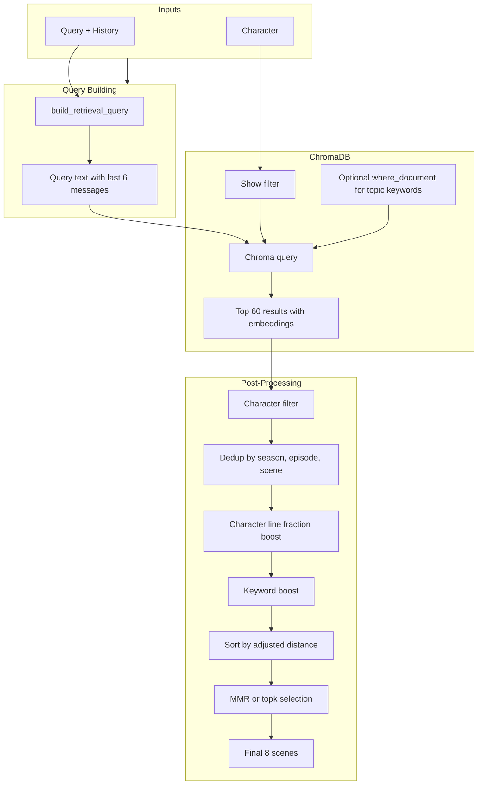

# Retrieval Pipeline Design

This document describes the retrieval pipeline for the TV Character Chatbot RAG system.

## Overview

The pipeline retrieves scene-level dialogue from ChromaDB to use as few-shot examples in the system prompt. The goal is to surface scenes that are both relevant to the user's query and representative of the selected character's voice.

## Retrieval Funnel

## Topic Keywords

When the query contains one of these keywords, Chroma's `where_document` filter restricts results to docs containing that term. This surfaces iconic, topic-specific scenes that semantic search alone might miss.

| Keyword | Purpose |
|---------|---------|
| downsizing | Michael's pilot line "downsizing is a bitch" |
| bazinga | Sheldon's catchphrase |
| dundie, dundies | The Office Dundie Awards |
| scranton | Dunder Mifflin Scranton setting |
| couch, spot | Sheldon's spot on the couch |
| that's what she said, thats what she said | Michael's catchphrase |
| bears, beets, battlestar galactica | Dwight's iconic references |

## Scoring Adjustments (Calculations)

### Character Line Fraction (25%)

Scenes where the target character has more lines provide better voice examples. The metadata `character_line_fraction` stores each character's share of lines in the scene. A higher fraction reduces the distance by up to 25%, ranking those scenes higher.

**Formula:** `adjusted_dist = dist * (1.0 - 0.25 * frac)`

**Rationale:** A scene where Sheldon dominates the dialogue is more useful for imitating his voice than one where he has a single line.

### Keyword Boost (35%)

When query terms (length ≥ 4, excluding stop words) appear in the document text, the distance is multiplied by 0.65 (effectively a 35% boost). This surfaces topic-specific scenes when semantic similarity alone might rank them lower.

**Formula:** `adjusted_dist *= 0.65` when any query term (≥4 chars, non-stop) appears in doc.

**Rationale:** For "What do you think about downsizing?", the pilot scene with "downsizing is a bitch" may not rank in Chroma's top 60 by embedding distance alone. The keyword boost ensures it surfaces when the user explicitly asks about downsizing.

## When to Rebuild ChromaDB

Run `python build_chromadb.py --reset` if:

- `character_line_fraction` is missing from metadata (older collections)
- You've changed the CSV sources or parsing logic
- The collection appears corrupted or empty

## Strategies

- **topk:** Take the first k results by adjusted distance (relevance only).

- **mmr:** Maximal Marginal Relevance balances relevance and diversity. Uses `lambda_mult=0.6` to favor relevance while avoiding redundant scenes.

- **hybrid:** (Optional) Combines BM25 lexical search with Chroma semantic search via Reciprocal Rank Fusion (RRF), then applies the same post-processing.

## Retrieval Debug Logger (Agentic Feedback)

Enable with `--retrieval-debug` (chatbot) or `RETRIEVAL_DEBUG=1` (env) or `--debug` (run_eval). Logs each retrieval to `retrieval_debug.log` (JSONL) for self-reflection and tuning:

- **input:** query, character, strategy, topic_keyword (if any)
- **funnel:** n_chroma_results, n_after_character_filter, n_after_dedup, n_final
- **output:** selected doc_ids
- **candidates:** full ranked list with raw_dist, line_frac, keyword_boost, adjusted_dist, selected flag, preview
- **selected_previews:** text snippets of chosen scenes

Use this to inspect why certain scenes were chosen or rejected, and to iterate on boosts/keywords.
